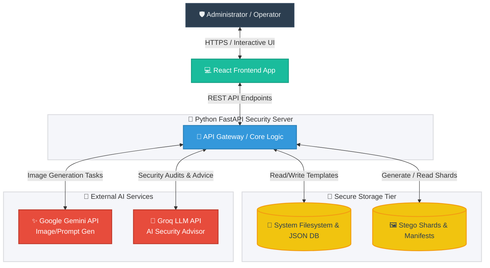
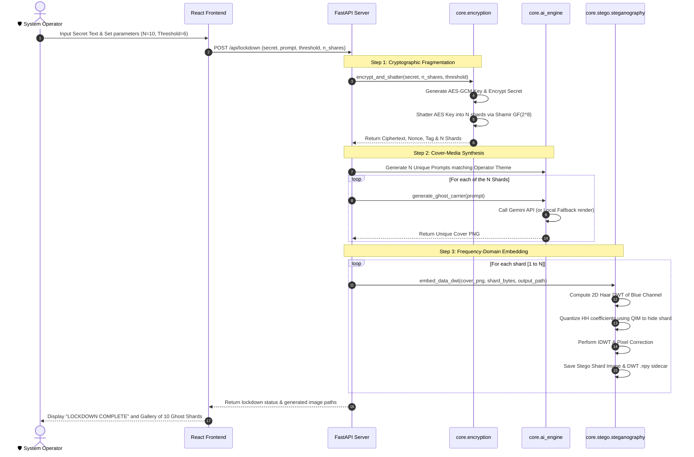
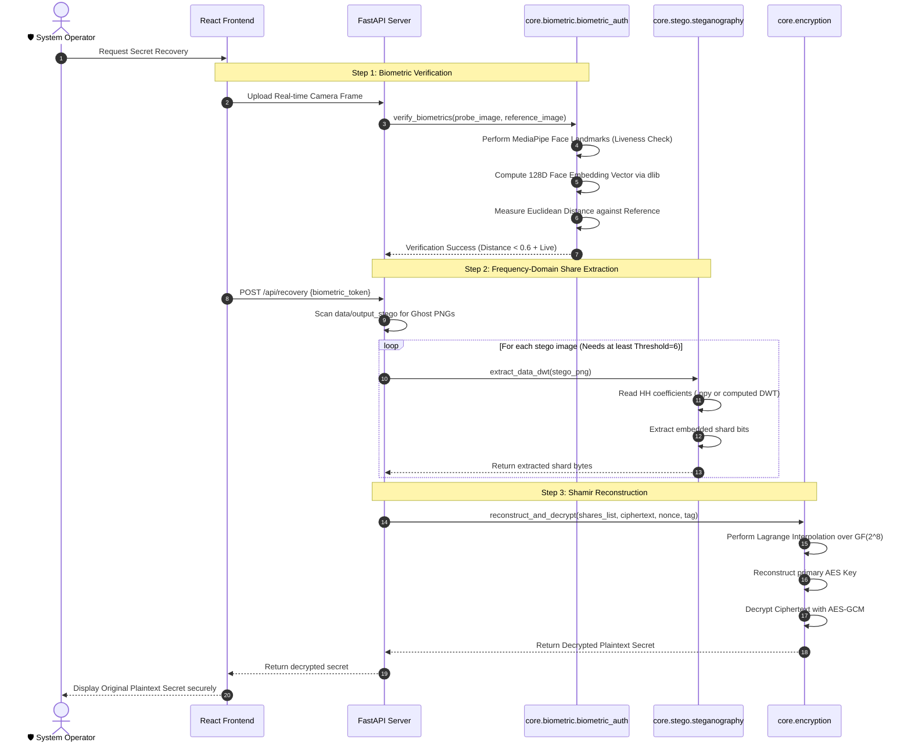
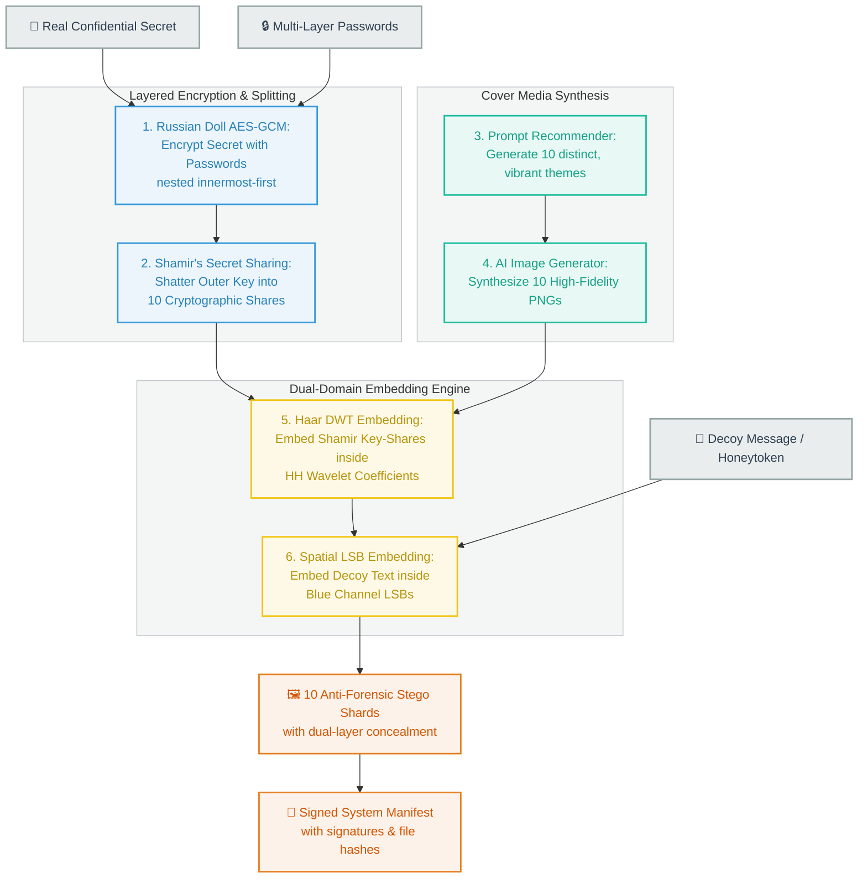

# Project Aegis Ghost: Use Case and Architecture Diagrams

This document contains the comprehensive use case and multi-layered architectural diagrams for **Project Aegis Ghost** (AI-Powered Steganography System for Military-Grade Data Concealment). 

The diagrams are written in **Mermaid.js** format. They will render natively in GitHub, VS Code (with Mermaid preview extensions), and other markdown rendering environments.

---

## 1. System Context Diagram (Tier 1 Architecture)

The Tier 1 architecture diagram provides a high-level view of Project Aegis Ghost, showing how users interact with the React Frontend, which communicates with the Python FastAPI Backend. The backend orchestrates local security operations and integrates with external AI APIs (like Google Gemini and Groq LLM) for cover-media generation and intelligent threat analysis.



---

## 2. Detailed Component Architecture (Tier 2 Architecture)

The Tier 2 architecture shows the internal components of the React Frontend and the FastAPI Backend, highlighting the modularity of the security layers. The FastAPI server acts as a unified controller directing traffic to independent Python security services.

```mermaid
graph TB
    %% Define Styles
    classDef feComp fill:#e8f8f5,stroke:#1abc9c,stroke-width:2px,color:#16a085;
    classDef beRoute fill:#ebf5fb,stroke:#3498db,stroke-width:2px,color:#2980b9;
    classDef beCore fill:#fef9e7,stroke:#f1c40f,stroke-width:2px,color:#b7950b;
    classDef storage fill:#fdf2e9,stroke:#e67e22,stroke-width:2px,color:#d35400;

    %% Frontend Components
    subgraph React_Frontend [Client UI - React & Vanilla CSS]
        UI_Dashboard[Dashboard Hub]:::feComp
        UI_Auth[Biometric & Pattern Lock]:::feComp
        UI_Shamir[Shamir Stego Control]:::feComp
        UI_Stego[Single Stego Hide/Reveal]:::feComp
        UI_StegAnalysis[Neural Steganalysis]:::feComp
        UI_Watermark[Watermarking Console]:::feComp
        UI_Chat[Secure E2E Messenger]:::feComp
        UI_Monitor[Security Audit Viewer]:::feComp
    end

    %% Backend Router
    subgraph FastAPI_Server [REST API Core]
        API_Auth[/api/auth/*]:::beRoute
        API_Crypto[/api/crypto/*]:::beRoute
        API_Stego[/api/stego/*]:::beRoute
        API_GenAI[/api/genai/*]:::beRoute
        API_Watermark[/api/watermark/*]:::beRoute
        API_Chat[/api/chat/*]:::beRoute
        API_Monitor[/api/monitor/*]:::beRoute
    end

    %% Backend Logic Layer (Modular Python Cores)
    subgraph Core_Security_Engines [Logical Security Core Services]
        Eng_Auth[auth_service.py<br/>Credential & OTP Logic]:::beCore
        Eng_Biometrics[biometric_auth.py<br/>dlib Face & Liveness]:::beCore
        Eng_Gesture[gesture_auth.py<br/>Pattern Normalization]:::beCore
        Eng_Crypto[encryption.py<br/>Shamir Secret Sharing & AES]:::beCore
        Eng_DWT[steganography.py<br/>LSB & Haar DWT Engine]:::beCore
        Eng_StegAnalysis[steganalysis.py<br/>Statistical & CNN StegNet]:::beCore
        Eng_Watermark[digital_watermarking.py<br/>Visible/Invisible Forensic]:::beCore
        Eng_Chat[secure_messaging.py<br/>E2E Cryptographic Chat]:::beCore
        Eng_Monitor[security_monitor.py<br/>Impossible Travel & Anomalies]:::beCore
        Eng_Advisor[security_advisor_llm.py<br/>LLM Threat Analysis]:::beCore
    end

    %% Storage Modules
    subgraph Persistent_Layer [Secure Database & Filesystem]
        JSON_DB[(users.json<br/>Registry & Biometrics)]:::storage
        Shards_Dir[(data/output_stego/<br/>Cover Images & Shards)]:::storage
        Audit_Logs[(data/audit/audit.log<br/>Encrypted Security Logs)]:::storage
    end

    %% Linkages
    UI_Dashboard --> UI_Auth
    UI_Dashboard --> UI_Shamir
    UI_Dashboard --> UI_Stego
    UI_Dashboard --> UI_StegAnalysis
    UI_Dashboard --> UI_Watermark
    UI_Dashboard --> UI_Chat
    UI_Dashboard --> UI_Monitor
    
    UI_Auth --> API_Auth
    UI_Shamir --> API_Crypto
    UI_Shamir --> API_Stego
    UI_Shamir --> API_GenAI
    UI_Stego --> API_Stego
    UI_StegAnalysis --> API_Stego
    UI_Watermark --> API_Watermark
    UI_Chat --> API_Chat
    UI_Monitor --> API_Monitor

    API_Auth --> Eng_Auth
    API_Auth --> Eng_Biometrics
    API_Auth --> Eng_Gesture
    API_Crypto --> Eng_Crypto
    API_Stego --> Eng_DWT
    API_Stego --> Eng_StegAnalysis
    API_GenAI --> Eng_Advisor
    API_Watermark --> Eng_Watermark
    API_Chat --> Eng_Chat
    API_Monitor --> Eng_Monitor
    API_Monitor --> Eng_Advisor

    Eng_Auth --> JSON_DB
    Eng_Biometrics --> JSON_DB
    Eng_Gesture --> JSON_DB
    Eng_Crypto --> Shards_Dir
    Eng_DWT --> Shards_Dir
    Eng_Watermark --> Shards_Dir
    Eng_Monitor --> Audit_Logs
```

---

## 3. Comprehensive Use Case Diagram

This diagram displays all available use cases for the three main system actors: the **System Administrator / Device Owner**, the **Security Analyst / Counter-Stego Officer**, and the **Secure Messenger / Communicator**.

```mermaid
graph TD
    %% Actors
    subgraph Actors [👤 System Actors]
        Owner["🛡️ System Owner (Admin)"]
        Analyst["🔍 Security Analyst"]
        Communicator["💬 Secure Communicator"]
    end

    %% Use Cases Grouped by Area
    subgraph Owner_Use_Cases [🛡️ System Owner Use Cases]
        UC_Reg(["Register Account / Password"])
        UC_OTP(["Verify Identity via OTP Email"])
        UC_FaceReg(["Enroll Reference Face Reference"])
        UC_PatternReg(["Enroll Access Grid Pattern"])
        UC_Profile(["Manage User Profile & ID Details"])
        UC_Lockdown(["Initiate Complete Lockdown"])
        UC_Recovery(["Perform Secure Recovery"])
        UC_Settings(["Configure System Settings"])
        UC_Audits(["View Encrypted Security Logs"])
    end

    subgraph Analyst_Use_Cases [🔍 Security Analyst Use Cases]
        UC_StegAnalyze(["Analyze Single Image"])
        UC_StegBatch(["Perform Batch Steganalysis"])
        UC_StegDecode(["Extract Hidden Payload"])
        UC_WatermarkEmbed(["Embed Digital Watermark"])
        UC_WatermarkForensic(["Perform Forensic Watermark Analysis"])
        UC_AIAdvisor(["Consult AI Threat Advisor"])
    end

    subgraph Communicator_Use_Cases [💬 Communicator Use Cases]
        UC_ChatNormal(["Send E2E Encrypted Message"])
        UC_ChatStego(["Send Steganographic Message"])
        UC_ChatDestruct(["Send Self-Destruct Message"])
        UC_Gallery(["Embed Secrets into Gallery"])
    end

    %% Actor Relationships
    Owner --> UC_Reg
    Owner --> UC_OTP
    Owner --> UC_FaceReg
    Owner --> UC_PatternReg
    Owner --> UC_Profile
    Owner --> UC_Lockdown
    Owner --> UC_Recovery
    Owner --> UC_Settings
    Owner --> UC_Audits

    Analyst --> UC_StegAnalyze
    Analyst --> UC_StegBatch
    Analyst --> UC_StegDecode
    Analyst --> UC_WatermarkEmbed
    Analyst --> UC_WatermarkForensic
    Analyst --> UC_AIAdvisor

    Communicator --> UC_ChatNormal
    Communicator --> UC_ChatStego
    Communicator --> UC_ChatDestruct
    Communicator --> UC_Gallery

    %% Cross-cutting connections
    Analyst -->|Inherits Security Controls| Owner
    Communicator -->|Uses Biometric Login| Owner

    %% Styling
    classDef actor fill:#2C3E50,stroke:#34495E,stroke-width:2px,color:#ECF0F1;
    classDef uc fill:#fcf3cf,stroke:#f1c40f,stroke-width:2px,color:#2C3E50;

    class Owner,Analyst,Communicator actor;
    class UC_Reg,UC_OTP,UC_FaceReg,UC_PatternReg,UC_Profile,UC_Lockdown,UC_Recovery,UC_Settings,UC_Audits uc;
    class UC_StegAnalyze,UC_StegBatch,UC_StegDecode,UC_WatermarkEmbed,UC_WatermarkForensic,UC_AIAdvisor uc;
    class UC_ChatNormal,UC_ChatStego,UC_ChatDestruct,UC_Gallery uc;

```



---

## 4. Key Sequential Flows (Tier 3 Architecture)

These sequence diagrams provide a deep dive into the system's most complex operations: the Lockdown workflow, the Recovery workflow, and the advanced Russian Doll with Fake LSB steganography workflow.

### A. Core Lockdown Process Flow (Secret Concealment)

This diagram details the chronological execution flow when an operator triggers a system Lockdown. It shows how the secret is secured through a cascade of cryptographic algorithms before being distributed into multiple AI-generated cover images.



---

### B. Core Recovery Process Flow (Secret Reconstruction)

This diagram explains the recovery workflow, showing how the system checks biometric identity and extracts hidden data bits to rebuild the original secret.



---

### C. Advanced "Russian Doll" with Fake LSB Steganography Flow

This process models a decoy steganography workflow designed to deceive attackers scanning for steganographic content. It embeds a misleading "decoy" message in the easily detectable spatial domain (LSB), while hiding the actual secret within the frequency domain (DWT) protected by split keys.


